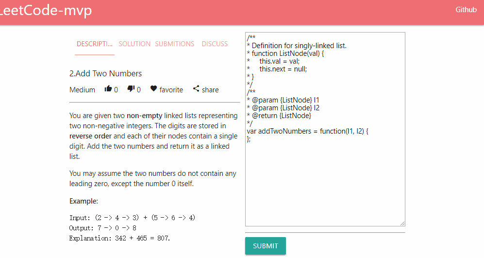

# leetcode-mvp

leetcode的最小可用实现 | mvp realization of leetcode



# 服务搭建 | try it yourself

环境 | env

- linux
- docker
- docker-compose

启动 | up

```
git clone https://github.com/postor/leetcode-mvp-services

cd leetcode-mvp-services

docker-compose up -d
```

使用 | visit

等待docker pulling和服务启动后访问 http://localhost/

wait for docker pulling and service start up, then open http://localhost/
